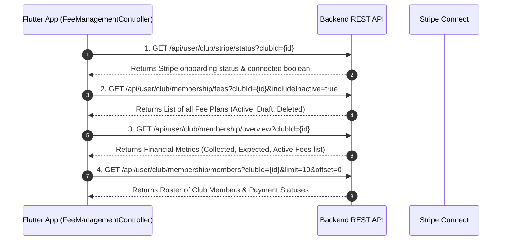

# Ride With Pals - Club Membership Fee Management API Documentation

This document provides a comprehensive technical overview and API reference for the **Club Membership Fee Management** system in *Ride With Pals*. It details how the fee management dashboard functions, the lifecycle of membership plans, and full specifications for all backend endpoints.

---

## 1. System Overview & Dashboard Architecture Workflow

When a club owner or manager opens the **Fee Management Dashboard** (`FeeManagementController`), the mobile app executes a synchronized multi-stage data loading sequence to populate financial metrics, active fee plans, and member payment rosters.



### Dashboard Synchronization Logic
- **`activeFees` Mapping**: The app merges plan definitions from `/membership/fees` into `activeFees` so draft plans (created with `saveAsDraft: true` or unassigned) display on screen alongside active plans.
- **Dynamic Currency Formatting**: Currency strings (`"eur"`, `"usd"`, `"gbp"`, `"aud"`, `"cad"`) are automatically mapped to standard symbols (`€`, `$`, `£`, `A$`, `C$`) across all dashboard widgets.
- **Draft vs. Active Fees**: 
  - Tapping **"Create Fee (Unassigned)"** or **"Create & Send Payment Requests"** sends `"saveAsDraft": false`, marking the fee active.
  - Tapping **"Save as Draft"** explicitly sends `"saveAsDraft": true`.

---

## 2. API Endpoints Summary

| # | Feature / Action | HTTP Method | Endpoint Path |
|---|------------------|-------------|---------------|
| 1 | Stripe Status | `GET` | `/api/user/club/stripe/status?clubId={id}` |
| 2 | Stripe Onboarding URL | `GET` | `/api/user/club/stripe/connect?clubId={id}` |
| 3 | Get Membership Fees (Plans) | `GET` | `/api/user/club/membership/fees?clubId={id}&includeInactive=true` |
| 4 | Get Fee Overview & Metrics | `GET` | `/api/user/club/membership/overview?clubId={id}` |
| 5 | Get Member Roster & Fee Status | `GET` | `/api/user/club/membership/members?clubId={id}&feeId={id}&status={status}` |
| 6 | Create Membership Fee | `POST` | `/api/user/club/membership/fee` |
| 7 | Update Membership Fee | `PUT` | `/api/user/club/membership/fee` |
| 8 | Delete Membership Fee | `DELETE` | `/api/user/club/membership/fee` |
| 9 | Record Manual (Offline) Payment | `POST` | `/api/user/club/membership/manual-pay` |
| 10 | Change Member's Assigned Fee | `POST` | `/api/user/club/membership/change/fee` |
| 11 | Exempt / Un-exempt Member | `POST` | `/api/user/club/membership/exempt` |
| 12 | Reset Status to Pending | `POST` | `/api/user/club/membership/reset-pending` |
| 13 | Send Payment Reminder Notification | `POST` | `/api/user/club/membership/pay/reminder/notification` |

---

## 3. Detailed API Specifications

### Common Request Headers
All API requests require an authorized JWT Bearer Token:
```http
Authorization: Bearer <JWT_ACCESS_TOKEN>
Content-Type: application/json
Accept: application/json
```

---

### API 1: Get Stripe Connect Status
Checks whether the club has connected and completed onboarding on Stripe Connect.

- **Method**: `GET`
- **URL**: `/api/user/club/stripe/status?clubId=49`

#### Query Parameters
| Parameter | Type | Required | Description |
|---|---|---|---|
| `clubId` | integer | Yes | ID of the target club |

#### Response (`200 OK`)
```json
{
  "statusCode": 200,
  "message": "Stripe status retrieved successfully",
  "data": {
    "connected": true,
    "onboardingComplete": true,
    "accountId": "acct_1Nxxxxxxxxxxxxxx"
  }
}
```

---

### API 2: Get Stripe Onboarding Link
Retrieves the Stripe Connect onboarding URL to redirect the club manager for payment setup.

- **Method**: `GET`
- **URL**: `/api/user/club/stripe/connect?clubId=49`

#### Response (`200 OK`)
```json
{
  "statusCode": 200,
  "message": "Onboarding URL generated",
  "data": {
    "onboardingUrl": "https://connect.stripe.com/setup/s/xxxxxxxxxxxx"
  }
}
```

---

### API 3: Get All Club Membership Fees / Plans
Retrieves all fee plans created for the specified club. Passing `includeInactive=true` includes draft and deleted plans.

- **Method**: `GET`
- **URL**: `/api/user/club/membership/fees?clubId=49&includeInactive=true`

#### Response (`200 OK`)
```json
{
  "statusCode": 200,
  "message": "Success",
  "data": [
    {
      "id": 22,
      "clubId": 49,
      "name": "Annual Membership Fee 2026",
      "description": "Full access to all club rides and events",
      "price": "25.00",
      "currency": "EUR",
      "billingInterval": "annual",
      "autoRenew": true,
      "isActive": true,
      "isDeleted": false,
      "createdAt": "2026-01-01T00:00:00.000Z"
    }
  ]
}
```

---

### API 4: Get Club Membership Overview & Metrics
Returns overall financial metrics, totals collected vs. expected, and active plans summary.

- **Method**: `GET`
- **URL**: `/api/user/club/membership/overview?clubId=49`

#### Response (`200 OK`)
```json
{
  "statusCode": 200,
  "message": "Success",
  "data": {
    "totalCollected": 150.00,
    "totalExpected": 500.00,
    "paidMemberCount": 6,
    "pendingMemberCount": 14,
    "notRenewedMemberCount": 2,
    "activeFees": [
      {
        "id": 22,
        "name": "Annual Membership Fee 2026",
        "price": 25.00,
        "currency": "EUR",
        "billingInterval": "annual",
        "autoRenew": true,
        "totalCount": 20,
        "paidCount": 6,
        "pendingCount": 14
      }
    ]
  }
}
```

---

### API 5: Get Club Membership Roster & Member Statuses
Retrieves members of the club with payment status filtering.

- **Method**: `GET`
- **URL**: `/api/user/club/membership/members?clubId=49&limit=10&offset=0&feeId=22&status=pending`

#### Query Parameters
| Parameter | Type | Required | Description |
|---|---|---|---|
| `clubId` | integer | Yes | Target club ID |
| `feeId` | integer | No | Filter members assigned to specific fee ID |
| `status` | string | No | Filter status: `paid`, `pending`, `not_renewed`, `exempt` |
| `limit` | integer | No | Pagination limit (default `10`) |
| `offset` | integer | No | Pagination offset (default `0`) |

#### Response (`200 OK`)
```json
{
  "statusCode": 200,
  "message": "Success",
  "data": [
    {
      "id": 101,
      "userId": 55,
      "memberName": "Alex Morgan",
      "email": "alex@example.com",
      "feeId": 22,
      "feeName": "Annual Membership Fee 2026",
      "feeAmount": 25.00,
      "currency": "EUR",
      "status": "Pending",
      "lastRequestDate": "2026-02-01T10:00:00.000Z",
      "expirationDate": "2026-12-31T23:59:59.000Z",
      "remindersSent": 1
    }
  ]
}
```

---

### API 6: Create Membership Fee Plan
Creates a new membership fee plan and optionally assigns it to members.

- **Method**: `POST`
- **URL**: `/api/user/club/membership/fee`

#### Request Body
```json
{
  "clubId": 49,
  "name": "Annual Membership Fee 2026",
  "price": 25.00,
  "currency": "EUR",
  "billingInterval": "annual",
  "startDate": "2026-01-01T00:00:00.000Z",
  "endDate": "2026-12-31T23:59:59.000Z",
  "allowStripe": true,
  "allowManual": true,
  "autoRenew": true,
  "assignmentTarget": "none",
  "assignedMemberIds": [],
  "saveAsDraft": false
}
```

#### Fields Description
- `assignmentTarget`: `"all"` (assign to all club members), `"specific"` (use `assignedMemberIds`), `"none"` (create plan without sending requests yet).
- `saveAsDraft`: `false` for active fee, `true` for draft state.

#### Response (`200 OK`)
```json
{
  "statusCode": 200,
  "message": "Membership fee plan created successfully",
  "data": {
    "id": 22,
    "clubId": 49,
    "name": "Annual Membership Fee 2026",
    "price": "25.00",
    "currency": "EUR",
    "billingInterval": "annual",
    "isActive": true
  }
}
```

---

### API 7: Update Membership Fee Plan
Updates an existing membership fee plan.

- **Method**: `PUT`
- **URL**: `/api/user/club/membership/fee`

#### Request Body
```json
{
  "feeId": 22,
  "clubId": 49,
  "name": "Updated Membership Fee 2026",
  "price": 30.00,
  "currency": "EUR",
  "billingInterval": "annual",
  "startDate": "2026-01-01T00:00:00.000Z",
  "endDate": "2026-12-31T23:59:59.000Z",
  "allowStripe": true,
  "allowManual": true,
  "autoRenew": false,
  "assignmentTarget": "all",
  "assignedMemberIds": [],
  "saveAsDraft": false
}
```

#### Response (`200 OK`)
```json
{
  "statusCode": 200,
  "message": "Membership fee plan updated successfully",
  "data": {
    "id": 22,
    "name": "Updated Membership Fee 2026",
    "price": "30.00"
  }
}
```

---

### API 8: Delete Membership Fee Plan
Deletes an existing membership fee plan.

- **Method**: `DELETE`
- **URL**: `/api/user/club/membership/fee`

#### Request Body
```json
{
  "clubId": 49,
  "feeId": 22
}
```

#### Response (`200 OK`)
```json
{
  "statusCode": 200,
  "message": "Membership fee deleted successfully"
}
```

---

### API 9: Record Manual / Offline Payment
Records a cash, bank transfer, or manual payment made by a member.

- **Method**: `POST`
- **URL**: `/api/user/club/membership/manual-pay`

#### Request Body
```json
{
  "clubId": 49,
  "feeId": 22,
  "userId": 55,
  "amount": 25.00,
  "paymentDate": "2026-02-05T12:00:00.000Z",
  "paymentMethod": "cash",
  "note": "Paid in cash at weekend club ride"
}
```

#### Response (`200 OK`)
```json
{
  "statusCode": 200,
  "message": "Manual payment recorded successfully"
}
```

---

### API 10: Change Member's Assigned Fee
Re-assigns a member to a different membership fee plan.

- **Method**: `POST`
- **URL**: `/api/user/club/membership/change/fee`

#### Request Body
```json
{
  "clubId": 49,
  "userId": 55,
  "newFeeId": 23
}
```

#### Response (`200 OK`)
```json
{
  "statusCode": 200,
  "message": "Member fee plan updated successfully"
}
```

---

### API 11: Exempt / Un-exempt Member
Exempts a member from paying a membership fee (or removes an existing exemption).

- **Method**: `POST`
- **URL**: `/api/user/club/membership/exempt`

#### Request Body
```json
{
  "clubId": 49,
  "userId": 55,
  "feeId": 22,
  "isExempt": true
}
```

#### Response (`200 OK`)
```json
{
  "statusCode": 200,
  "message": "Member exemption status updated"
}
```

---

### API 12: Reset Status to Pending
Resets a member's fee status back to `Pending` to allow resending payment requests.

- **Method**: `POST`
- **URL**: `/api/user/club/membership/reset-pending`

#### Request Body
```json
{
  "clubId": 49,
  "userId": 55,
  "feeId": 22
}
```

#### Response (`200 OK`)
```json
{
  "statusCode": 200,
  "message": "Member status reset to pending"
}
```

---

### API 13: Send Payment Reminder Notification
Triggers automated push/email payment reminders to members.

- **Method**: `POST`
- **URL**: `/api/user/club/membership/pay/reminder/notification`

#### Request Body (Bulk Send to Pending Members)
```json
{
  "clubId": 49,
  "feeId": 22,
  "target": "pending"
}
```

#### Request Body (Specific Members)
```json
{
  "clubId": 49,
  "feeId": 22,
  "target": "specific",
  "memberIds": [55, 58]
}
```

#### Response (`200 OK`)
```json
{
  "statusCode": 200,
  "message": "Payment reminders sent successfully"
}
```

---

## 4. Frontend Code Location Reference

| Module | File Path |
|---|---|
| **Controller** | [fee_management_controller.dart](file:///c:/Users/Dell/StudioProjects/ride_with_pals/lib/pages/club_section/drawar_section/fee_mangement/controller/fee_management_controller.dart) |
| **Overview Tab** | [overview_tab.dart](file:///c:/Users/Dell/StudioProjects/ride_with_pals/lib/pages/club_section/drawar_section/fee_mangement/widget/overview_tab.dart) |
| **Fee Details Screen** | [fee_detail_screen.dart](file:///c:/Users/Dell/StudioProjects/ride_with_pals/lib/pages/club_section/drawar_section/fee_mangement/widget/fee_detail_screen.dart) |
| **Member Details Screen**| [member_detail_screen.dart](file:///c:/Users/Dell/StudioProjects/ride_with_pals/lib/pages/club_section/drawar_section/fee_mangement/widget/member_detail_screen.dart) |
| **Create Fee Wizard** | [create_fee_wizard.dart](file:///c:/Users/Dell/StudioProjects/ride_with_pals/lib/pages/club_section/drawar_section/fee_mangement/widget/create_fee_wizard.dart) |
| **Repository Layer** | [club_repository.dart](file:///c:/Users/Dell/StudioProjects/ride_with_pals/lib/core/repositories/club_repository.dart) |
| **Service Layer** | [club_service.dart](file:///c:/Users/Dell/StudioProjects/ride_with_pals/lib/core/services/club_service.dart) |
